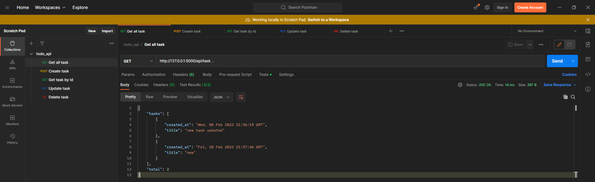

<div id="top"></div>

<br />
<div align="center">
  <a href="https://github.com/dmitrii1011sg/api_todos.git">
    
  </a>

<h3 align="center">Todos API</h3>

  <p align="center">
    Simple API for your Todos
    <br />
    <a href="https://github.com/dmitrii1011sg/api_todos.git"><strong>Project Repository</strong></a>
    <br />
    <br />
  </p>
</div>


<!-- TABLE OF CONTENTS -->
<details>
  <summary>Table of Contents</summary>
  <ol>
    <li>
      <a href="#about-the-project">About The Project</a>
      <ul>
        <li><a href="#built-with">Built With</a></li>
      </ul>
    </li>
    <li>
      <a href="#getting-started">Getting Started</a>
      <ul>
        <li><a href="#installation">Installation</a></li>
      </ul>
    </li>
    <li><a href="#contact">Contact</a></li>
  </ol>
</details>


<!-- ABOUT THE PROJECT -->
## About The Project


Simple API for Todos. The project implements all the main functions. More functionality is planned to be added in the future. </br>
The project also has postman with tests for all requests.
<p align="right">(<a href="#top">Back to top</a>)</p>


### Build with 

* [Flask](https://pypi.org/project/Flask/)
* [Flask-RESTful](https://pypi.org/project/Flask-RESTful/)
* [SQLAlchemist](https://pypi.org/project/SQLAlchemy/)

<p align="right">(<a href="#top">Back to top</a>)</p>


<!-- GETTING STARTED -->
## Getting Started

To run the api follow these simple steps.

### Installation

1. Clone repo 
   ```sh
   git clone https://github.com/dmitrii1011sg/api_todos.git
   ```
2. Install all packages
   ```sh
   pip install -r requirements.txt
   ```


<p align="right">(<a href="#top">Back to top</a>)</p>

<!-- CONTACT -->
## Contact

Dmitrii Gorshkov - [@telegram_handle](https://t.me/dmitrii1011) - dmitrii1011sg@gmail.com - Developer </br>
Valeria Sklarova - [@telegram_handle](https://t.me/chuuiqs) - avoralks101@gmail.com - Developer

Project Link: [https://github.com/dmitrii1011sg/api_todos.git](https://github.com/dmitrii1011sg/api_todos.git)

<p align="right">(<a href="#top">Back to top</a>)</p>

[product-screenshot1]: doc/img1.png